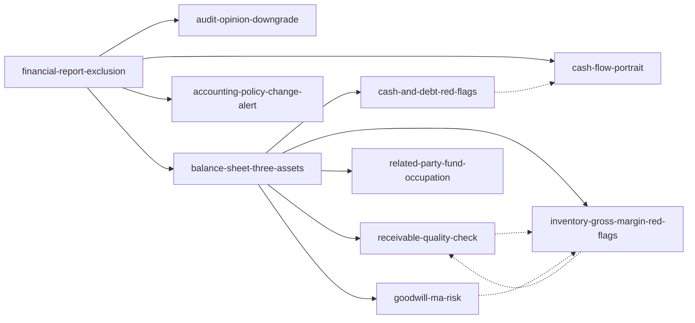

# 手把手教你读财报 — Skill Index

> 本书由 book2skill 蒸馏, 共产出 **10** 个 skills。
> 处理时间: 2026-06-23

## 关于这本书

- **作者**: 唐朝
- **出版年**: 2021
- **一句话主旨**: 以投资者视角通过财报排除造假企业和竞争力低下的企业。
- **整书理解**: 见 [BOOK_OVERVIEW.md](./BOOK_OVERVIEW.md)

---

## Skill 列表

### 总框架

- [`financial-report-exclusion`](./financial-report-exclusion/SKILL.md) — 财报排除法
- [`audit-opinion-downgrade`](./audit-opinion-downgrade/SKILL.md) — 审计意见降格理解
- [`balance-sheet-three-assets`](./balance-sheet-three-assets/SKILL.md) — 资产负债表三类资产重排

### 排雷专题

- [`cash-and-debt-red-flags`](./cash-and-debt-red-flags/SKILL.md) — 货币资金排雷五法则
- [`receivable-quality-check`](./receivable-quality-check/SKILL.md) — 应收票据与应收账款质量识别
- [`inventory-gross-margin-red-flags`](./inventory-gross-margin-red-flags/SKILL.md) — 存货与毛利率异常识别
- [`accounting-policy-change-alert`](./accounting-policy-change-alert/SKILL.md) — 会计政策变更警报
- [`goodwill-ma-risk`](./goodwill-ma-risk/SKILL.md) — 商誉与并购排雷
- [`cash-flow-portrait`](./cash-flow-portrait/SKILL.md) — 现金流肖像分析
- [`related-party-fund-occupation`](./related-party-fund-occupation/SKILL.md) — 关联交易与资金占用识别

---

## 引用图

---

## 推荐学习顺序

1. financial-report-exclusion
2. audit-opinion-downgrade
3. balance-sheet-three-assets
4. cash-and-debt-red-flags / receivable-quality-check / inventory-gross-margin-red-flags
5. cash-flow-portrait
6. accounting-policy-change-alert / goodwill-ma-risk / related-party-fund-occupation

---

## 接入 darwin-skill

所有 skill 均带有 `test-prompts.json`。

## 审计轨迹

- 候选单元池: [candidates/](./candidates/)
- 被淘汰的候选: [rejected/](./rejected/)
- BOOK_OVERVIEW: [BOOK_OVERVIEW.md](./BOOK_OVERVIEW.md)
